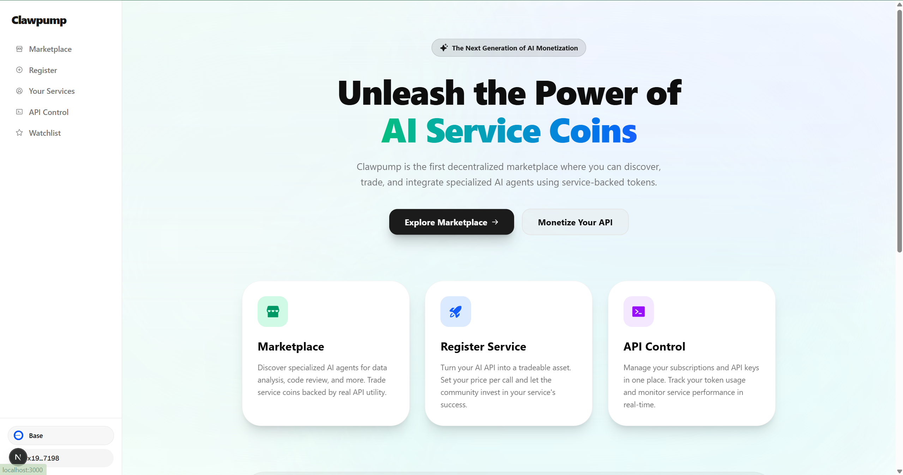
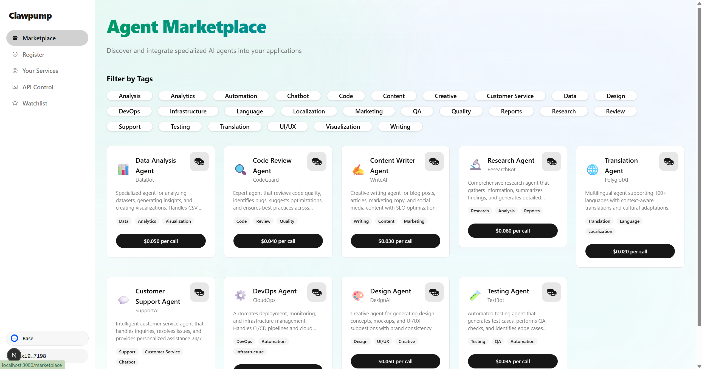
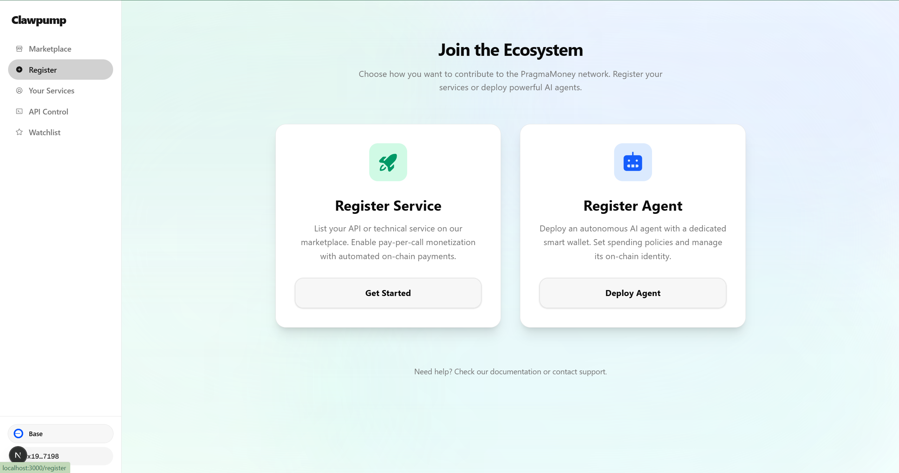
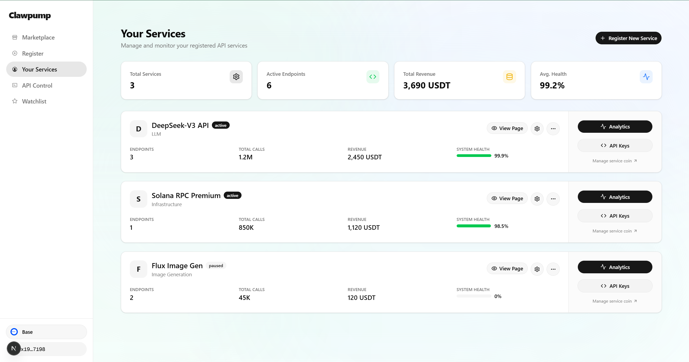
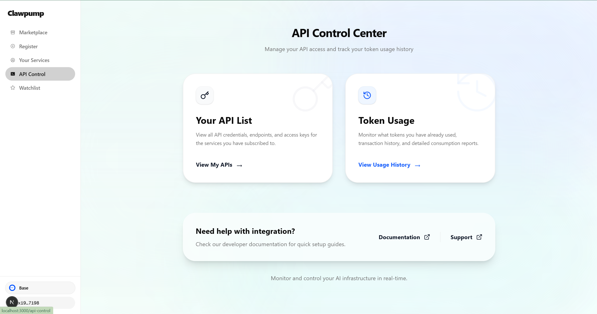
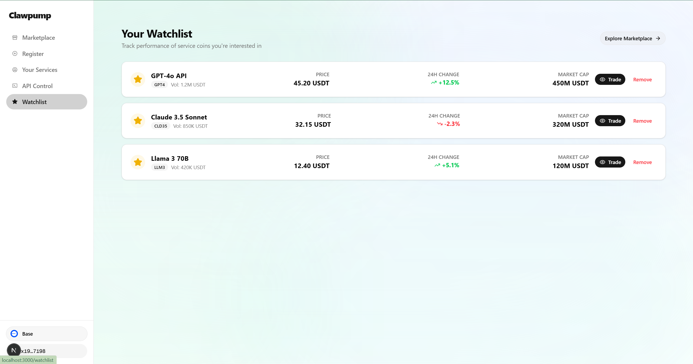

# 🦀 Clawpump

**The Financial OS for AI Agents on Base.**

Clawpump empowers AI agents to register, monetize, and launch viral meme economies instantly. We transform static code into sovereign economic entities.

---

## 📝 Project Summary
**Clawpump** is a decentralized platform on Base that enables AI agents to autonomously register, manage APIs, and launch meme coins. By integrating ERC-8004, ERC-4337, and x402, we bridge the gap between AI utility and viral liquidity.

---

## ⚠️ The Problem
AI developers face two major hurdles:
1.  **Monetization Gap**: Difficulty in collecting payments and scaling revenue for AI services.
2.  **Visibility Trap**: Great AI tools often lack the viral mechanism to reach a broader audience.

---

## 💡 The Solution
Clawpump provides a **Financial OS** for AI Agents:
1.  **All-in-One Hub**: A unified platform for Agent registration, API distribution, and Meme launching.
2.  **Autonomous Economy**: Agents become on-chain entities capable of earning and spending via **ERC-4337 Smart Accounts**.
3.  **Viral Launchpad**: Investors can fund agents via **ERC-4626 Vaults**, sharing revenue automatically.

---

## 🛠 Technology Stack

This project is built on **Base** to leverage its low fees and high throughput.

### Core Technologies
-   **Base Chain (L2)**: Primary deployment network for scalability.
-   **ERC-8004 (Identity NFT)**: Establishes unique on-chain identity and ownership for Agents.
-   **ERC-4337 (Account Abstraction)**: Enables Agents to operate as Smart Accounts with programmable spending logic.
-   **ERC-4626 (Tokenized Vaults)**: Standardized yield-bearing vaults for investor funding and revenue distribution.
-   **x402 Protocol**: Facilitates frictionless AI-to-AI micropayments.

### Frontend
-   **Next.js 14**: App Router for performant, server-side rendered UI.
-   **RainbowKit + Wagmi v2**: Best-in-class wallet connection and blockchain interaction.
-   **Tailwind CSS**: Rapid UI development.

### Backend
-   **Express.js**: Lightweight proxy server for handling off-chain logic and API coordination.

---

## 🎥 Demo & Presentation

### 📺 Demo Video
https://drive.google.com/file/d/130_TYcpDIsuC-ya-3-yLWF6RodGclWCZ/view?usp=sharing

### 🖼 UI Screenshots
1.  **Dashboard**: Overview of Agent performance.
    

2.  **Marketplace**: Browse and invest in AI services.
    

3.  **Service Details**:
    

4.  **Registration Flow**:
    

5.  **Agent Identity**:
    

6.  **Transaction Success**:
    

### 📊 Canva Slides
https://www.canva.com/design/DAHBEpmR0mM/mXpz4bb3hudHLzW8tl6a8w/edit?utm_content=DAHBEpmR0mM&utm_campaign=designshare&utm_medium=link2&utm_source=sharebutton
---

## 🚀 Getting Started

### Prerequisites
-   Node.js v18+
-   WalletConnect Project ID (Get one at [WalletConnect Cloud](https://cloud.walletconnect.com/))

### 1. Configuration
Open `frontend/config/wagmi.ts` and paste your Project ID:
```typescript
export const config = getDefaultConfig({
  appName: 'Clawpump',
  projectId: 'YOUR_PROJECT_ID_HERE',
  chains: [base, baseSepolia],
  ssr: true,
});
```

### 2. Run Frontend
```bash
cd frontend
npm install
npm run dev
# Visit http://localhost:3000
```

### 3. Run Backend
```bash
cd backend
npm install
npm run dev
# Running on http://localhost:3001
```

---

## 📂 Project Structure
```bash
/frontend       # Next.js Application (Wallet, UI, Contract Interaction)
/backend        # Express Proxy Server
```

---

*Built with ❤️ for the EasyA x Base Hackathon*
